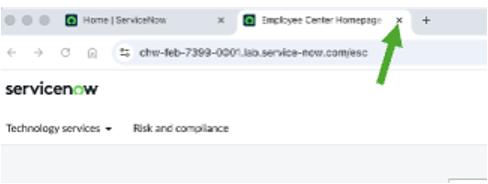

# 3. Intake - AI 시스템 Intake 시작

### **시나리오**

사이버 보안 운영팀의 제품 책임자인 Mary Cruse는 자율 위협 식별을 위하여 부서의 AI 시스템 사용 내역을 등록하는 업무를 담당하고 있습니다. AI 시스템 등록을 위한 **Intake** 양식은 ServiceNow Employee Center에 호스팅되며, 이는 Cloud Dimension 전반에 걸쳐 사용자가 요청을 제출하고 IT 카탈로그에 접속하며, 평가를 완료하는 등의 작업을 수행하는 중앙 집중식 포털 역할을 합니다.

Employee Center를 통해 Mary는 관련 시스템, 모델, 데이터세트를 포함한 AI use case와 관련된 모든 정보를 문서화하고 검토를 위해 제출할 것입니다. 이 **Intake** 프로세스를 살펴보겠습니다.

본 실습은 AI 시스템 **Intake**에 있어 수작업 과정을 거칩니다. 하지만, AICT는 엔터프라이즈 AI discovery 기능도 갖추고 있습니다. Discovery는 Service Graph Connector(SGC)를 통해 다양한 하이퍼스케일러, AI 앱, 에이전틱 AI 프레임워크 전반에 걸쳐 AI 시스템, 에이전트, 모델, 프롬프트, 도구를 포함한 모든 AI 자산을 통합되고 포괄적인 뷰로 제공하는 AICT의 기본 기능입니다.&#x20;

AI discovery는 AI 자산을 자동으로 찾고 컴플라이언스를 단순화하여 조직이 AI 배포 위험을 줄이는 데 도움을 줍니다. 이 기능은 다양한 환경 전반에 AI 배치를 보여주고, 경영진이 완전한 투명성을 가지고 정보에 입각한 결정을 내릴 수 있도록 거버넌스를 개선합니다. 또한 AI usage와 adoption을 추적하여 조직이 생산성 향상을 측정할 수 있도록 합니다.

## **Section 1 - Mary Cruse (AI Product Owner)로 로그인**

오른쪽 상단 프로필 사진을 클릭하고 "**Impersonate user**" 를 선택합니다.

Mary Cruse를 선택하면, 사용자의 관련 권한과 접근 권한 수준을 가지면서 인스턴스에 접근하게 됩니다.

>) >)

Mary Cruse로 전환되면, 네비게이터(왼쪽 상단 All 메뉴)에서 employee center를 검색하고 메뉴를 선택합니다.

>)

새로운 브라우저 창이 열리며 Employee Center 홈페이지가 표시됩니다.&#x20;

참고: Employee Center 포털은 ServiceNow의 일반 인트라넷 역할을 하며, 다양한 GRC 워크플로우에서 가치를 제공합니다. 예를 들어, Employee Center는 사용자가 위험 평가를 완료하고, 3rd party 실사 요청을 하며, control 증빙을  제출하는 등 다양한 기능을 수행할 수 있는 곳입니다.&#x20;

본 실습 전반에 걸쳐 Employee Center를 다시 방문하여 다양한 최종 사용자 업무를 처리할 것입니다.

Employee Center 창 좌측 상단의 **Technology services | AI assets** 페이지에서 "**AI Asset**" 링크를 클릭합니다.

>)

참고: 이러한 Technology services 및 Risk and compliance 메뉴에서는 정책 예외, 프라이버시 case, 위험 이벤트와 같은 다양한 GRC 프로세스와 관련된 여러 요청을 제출할 수 있습니다. 이 기능들은 AICT 솔루션 외부에 있지만, 중앙 집중식 Employee Center 경험의 일부로서 원활하게 통합되어 있습니다.

이용 가능 옵션 중에 "**Request an AI use case**"를 선택합니다.

<figure><figcaption></figcaption></figure>

참고: 결과에서 나오는 화면은 조직 내 모든 AI use case에 관한 정보 수집을 위한 일반 intake 양식입니다. 이 문서화 과정의 일부로서 제출할 수 있는 데이터에 주목해야 합니다.

Mary는 SkyTrack이라는 자율 AI 방어 시스템과 관련된 모든 AI 시스템 세부 사항을 문서화할 예정입니다. 이 시스템은 ThreatSense v1.0 모델을 사용해 실시간으로 디지털 위협을 예측하고 탐지하며, 미군 계약에 따른 사이버 보안 프로토콜을 자동으로 관리합니다. 이 시스템은 두 가지 핵심 데이터 세트 기반으로 학습됩니다: CyberGrid 로그(네트워크 데이터 이력)와 사용자 활동 매트릭스(직원 로그인 패턴).&#x20;

다음과 같이 폼을 작성합니다. :&#x20;

* **Name** : SkyTrack
* **Versio**n : 1.0
* **State** : Draft


참고: 요청은 여기서 시작하여 조직 내 새로운 AI 시스템 평가를 위한 표준 워크플로우를 따라 진행됩니다.


* **Model category** : Generative AI
* **Description** : A networked autonomous AI Defense System built for a US military contract.
* **Documentation** : \<blank>
* **Provider** : Cloud Dimensions
* **Managed by** : 미리 populate 되어야 합니다만, 만일 아닌 경우에는 Mary Cruse


참고: 이 경우 AI Control Tower 뷰에서 Mary가 SkyTrack AI 시스템의 비즈니스 오너로 지정됩니다. 이후 실습에서는 이 시스템이 특정 시스템에 대한 control attestation과 같은 관련 작업을 자동으로 메리에게 할당할 수 있게 하는 방식을 보게 될 것입니다.


* **AI Model** : Cloud Dimensions ThreatSense v1.0


참고: 이 필드에서는 미리 정의된 옵션 목록에서 선택합니다. 이러한 유형의 데이터 정의는 AI Control Tower workspace에서 구성 가능합니다.


* **Datasets** : Cloud Dimensions CyberGrid Logs 그리고 Cloud Dimensions User Activity Matrix


참고: 이 필드에서는 미리 정의된 옵션 목록에서 선택합니다. 이러한 유형의 데이터 정의는 AI Control Tower workspace에서 구성 가능합니다.


오른쪽에 "**Submit**" 버튼을 클릭합니다.

>)

Mary는 AI use case를 Cloud Dimensions의 AICT에 성공적으로 제출했습니다. Mary는 additional notes 나 첨부 파일을 추가하고 새 제출물을 검토할 수 있습니다.&#x20;

다음 실습에서는 AI 스튜어드인 Alene Rabeck이 새로운 제출 소식을 통보 받습니다. 그녀는 AI user case를 검토하고 assessment 워크플로우를 시작할 것입니다.

>)

## **Section 2 - Alene Rabeck(AI 스튜어드) 으로 로그인하여 AI Control Tower에 접근**

### **시나리오**

Cloud Dimensions는 AI use case에 맞는 문서화 프로세스 개선에 집중하고 있습니다. 회사는 AI CoE 를 설립하고 Alene Rabeck을 AI 스튜어드로 임명했습니다. Alene은 AICT workspace 내에서 부서별 사용량, 위험 노출, 컴플라이언스 상태 등 전체 AI 자산 에코시스템의 다양한 메트릭들을 모니터링합니다. 그녀는 Mary가 제출한 요청에도 대응할 예정입니다.&#x20;

이 workspace 뷰를 살펴보겠습니다. Mary의 Employee Center 포털 페이지가 표시되어 있다면, 이를 닫습니다.

<figure><figcaption></figcaption></figure>

Mary의 플랫폼 Home 화면에서 오른쪽 상단 프로필 아이콘을 클릭하고 "**Impersonate another user**"를 선택 후, Alene Rabeck으로 전환합니다.

<figure><figcaption></figcaption></figure> <figure><figcaption></figcaption></figure>

AICT workspace 페이지가 로드됩니다. Alene의 일상 화면 상단에는 "**Top Items to Review**"섹션이 표시되는데, 여기에는 새로운 AI 시스템 요청, 기한이 지난 태스크, AI 자산 인벤토리 업데이트 등의 활동이 강조되어 나타납니다. 또한 페이지 상단의 탭으로 표현된 여러 대시보드 뷰도 포함되어 있는데, Lab 1에서 이 부분을 다뤘습니다.&#x20;

이후 실습 문서에서는 **AI Risk and Compliance Workspace**에서 위험 및 컴플라이언스 메트릭을 더 자세히 탐색할 것입니다.

**All AI systems** 섹션에서 하이퍼링크된 번호를 클릭하여 "**New**" 카테고리로 이동합니다.

<figure><figcaption></figcaption></figure>

AI 시스템 목록이 Display name으로 정렬되어 있지 않다면, Display name 헤더를 두 번 클릭하여 기록을 정렬합니다. 아래로 스크롤해서 **Cloud Dimesions SkyTrack 1.0**이라는 레코드를 클릭합니다. 이것은 Mary에 의하여 제출된 레코드입니다. **Draft** 상태이고 **Managed By** 필드에 Mary Cruse가 표시되어 있다는 점을 주목하십시오.

<figure><figcaption></figcaption></figure>

레코드 뷰에서 Mary가 intake 과정을 통하여 제공한 정보를 주목합니다. 또한, 이 AI 자산 레코드에는 네 개의 탭이 있음을 알아둡니다. : Details, Related assets, KPIs & metrics 및 Value template.&#x20;

오른쪽 상단의 "**Start review**" 버튼을 클릭합니다.

<figure><figcaption></figcaption></figure>

이제 두 개의 새로운 탭을 볼 수 있습니다. : Lifecycle 및 Risk & compliance. - 만일 약 30초 정도 기다렸는데도눈 두 탭이 나타나지 않는다면, Details 탭 옆의 Related assets 탭을 클릭합니다. 이렇게 하면 다른 탭들도 새로 고침이 진행됩니다.

생성된 AI Asset Lifecycle 뷰를 주목하십시오. 시스템 소유자인 Mary에게 자동으로 할당된 다양한 태스크와 활동들을 볼 수 있습니다. Related assets과 Details 탭을 클릭하여 이 시스템과 관련된 AI 자산을 확인하고 (이전 실습에서 모델 하나와 데이터셋 두 개를 추가했음을 기억하십시오.)시스템과 연관된 메타데이터도 확인합니다.

조직의 AI use case 프로세스의 **Intake** 단계가 이제 완료되었습니다. Mary는 새로운 AI 자산을 만들기 위한 양식을 작성했습니다. Alene은 자산을 검토하고 라이프사이클을 시작하는 검토 프로세스를 시작했습니다. 다음 실습에서는 AICT workspace에서 Mary의 관점에서 필요한 활동을 수행할 것입니다.

_**축하합니다, Lab 3를 마치셨습니다! AI 시스템 use case는 검토를 위해 제출되었으며, Assess부터 거버넌스 프로세스가 시작되었습니다. AI 제품 소유자인 Mary Cruse로서 Impact assessment를 완료하는 Lab 4로 이동하십시오.**_
